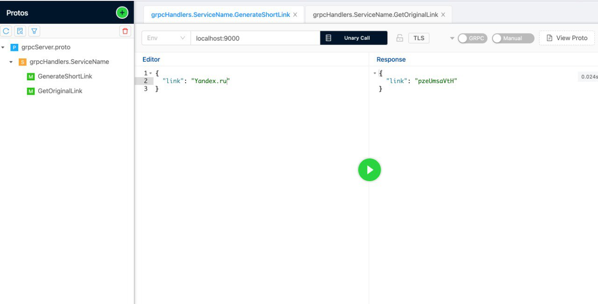
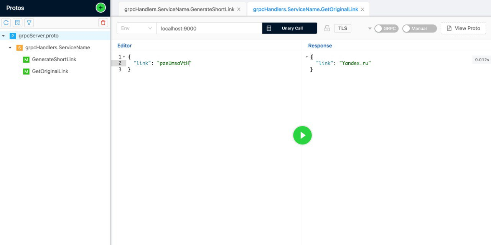
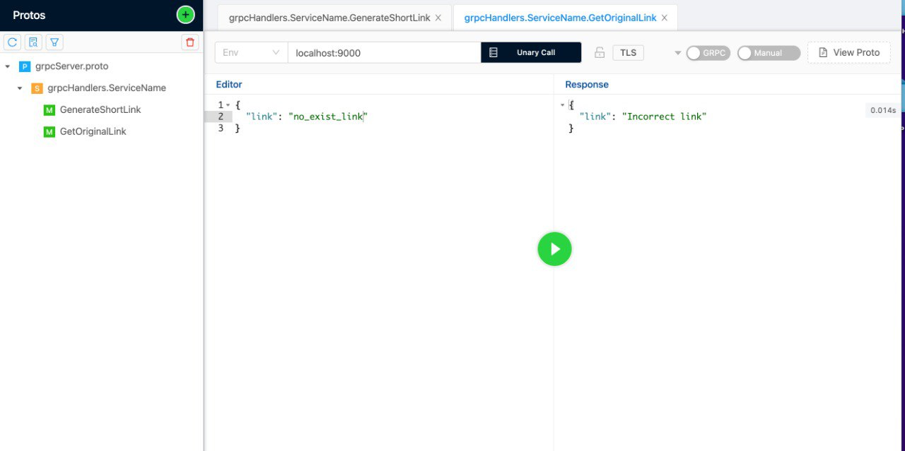

### Сервис предоставляющий API по сокращению ссылок черз http и gRPC.


Сервис разработан на языке Go и использует в качестве хранилища PostgreSQL либо In-Memory Storage. 
В качестве веб фреймворка используется стандартная библиотека `http` и `gRPC`. Для PostgreSQL использовал драйвер `jackc/pgx`.
Реализованы `http` и `gRPC` обработчики.

### Пример использования сервиса
#### Получение полной ссылки

`curl http://localhost:8080/?short=eZZHnmHDOc`

```json
{"url": "yandex.ru"}
```

#### Создание сокращенной ссылки

`curl -d "@data.json" -H "Content-Type: application/json" -X POST http://localhost:8080/generate`

```json
{
  "url": "yandex.ru"
}
```

Ответ:

Content-Type: application/json

```json
{
  "short": "eZZHnmHDOc"
}
```


### Запуск сервиса:

`make build` - первая сборка

`make restart` - пересборка

Для того чтобы использовать сервис локально нужно поднять `PostgreSQL` на порту `5432`.
Для выбора хранилища использовать флаг --storage=<inmemory/postgres>.

`go run cmd/main.go --storage=inmemory`

### Тесты gRPC

Тестировал через утилиту bloomrpc:




